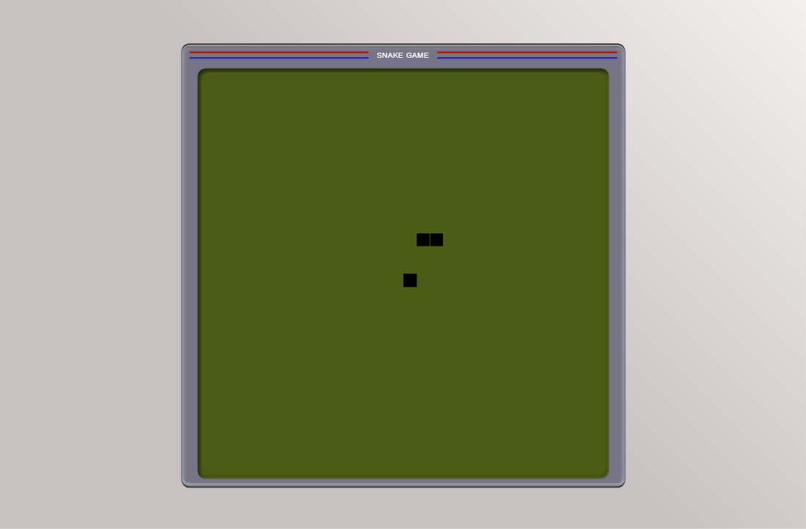

<p align="center">	
	<h1 align="center">Snake Game 2D :snake:</h1>
</p>
<p align="center">
    
</p>
    <p align="center"><em>O famoso jogo da cobrinha em 2D no qual o seu objetivo é comer até ficar enorme e acumular muitos pontos</em></p>
    <p align="center">
        
        
  	</p>
</p>

<p align="center">
	
</p>

## Traduções

* [Original](https://github.com/JefersonLucas/snake-game-2D/blob/master/README.md)
* [English](https://github.com/JefersonLucas/snake-game-2D/blob/master/translate/en/README.md)

## Começando :heavy_check_mark:

Essas instruções fornecerão uma cópia do projeto em execução na sua máquina local.

### Instalando :inbox_tray:

Siga passo a passo as seguinte formas de obter o código na sua máquina local.

#### Clonando o repositório

Inicie o repositorio na sua máquina local utilizando as linhas de comando.

```
#Clonar com SSH

mkdir snake-game-2D
cd snake-game-2D
git init
git clone git@github.com:JefersonLucas/snake-game-2D.git
```

```
#Clonar com HTTPS

mkdir snake-game-2D
cd snake-game-2D
git init
git clone https://github.com/JefersonLucas/snake-game-2D.git
```
Agora os arquivos que estão no repositório remoto estão clonados no repositório local.

#### Baixando o repositório

Você também pode [baixar](https://github.com/JefersonLucas/snake-game-2D/archive/master.zip) o repositório em formato zip.

## Ambiente

Veja aqui o a página do projeto implantado por @github-pages [ver implantação](https://jefersonlucas.github.io/the-matrix-effect/).

## Como jogar? :video_game:

Movimente utilizando as teclas de navegação: 
- Seta pra Cima :arrow_up:
- Seta pra Baixo :arrow_down:
- Seta pra Direita :arrow_right:
- Seta pra Esquerda :arrow_left:


## Contribuindo :up:

Leia o [CONTRIBUTING.md](https://github.com/JefersonLucas/snake-game-2D/blob/master/CONTRIBUTING.md) para obter detalhes sobre nosso código de conduta e o processo para enviar solicitações pull para nós.

## Versionamento :scroll:

Usamos o [SemVer](https://semver.org/lang/pt-BR/) para controle de versão. Para as versões disponíveis, consulte as [tags nesse repositório](https://github.com/JefersonLucas/snake-game-2D/tags). 

## Autores :pray:

* **Jeferson Lucas** - *Trabalho Inicial* - [JefersonLucas](https://github.com/JefersonLucas).

Veja também a lista de [contribuidores](https://github.com/JefersonLucas/snake-game-2D/contributors) que participaram deste projeto.

## Licença :copyright:

Este projeto está licenciado sob a licença MIT - consulte o arquivo [LICENSE.md](https://github.com/JefersonLucas/snake-game-2D/blob/master/LICENSE) para obter detalhes.

## Agradecimentos :clap:

* Primeiramente a Deus. 
* Meus sinceros agradecimentos a todos que visitam o projeto e deixa uma estrela como reconhecimento.
* Ao canal do [Programador BR](https://www.youtube.com/watch?v=Hua1OSXitdQ)  de onde tirei toda a inspiração para dar esse passo inicial nesse projeto.
